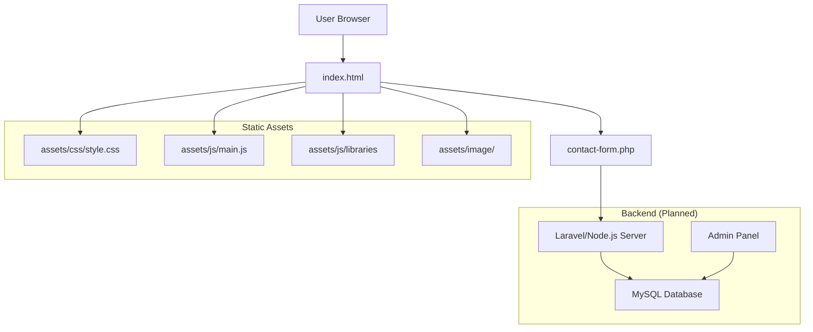
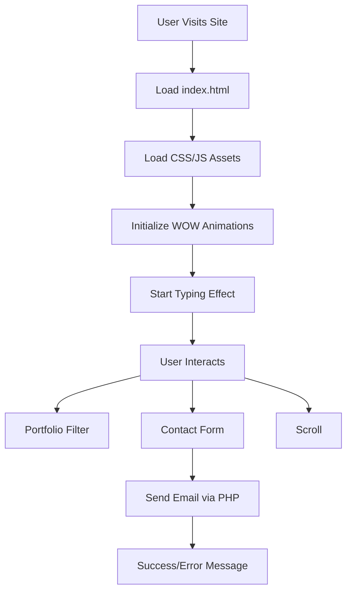
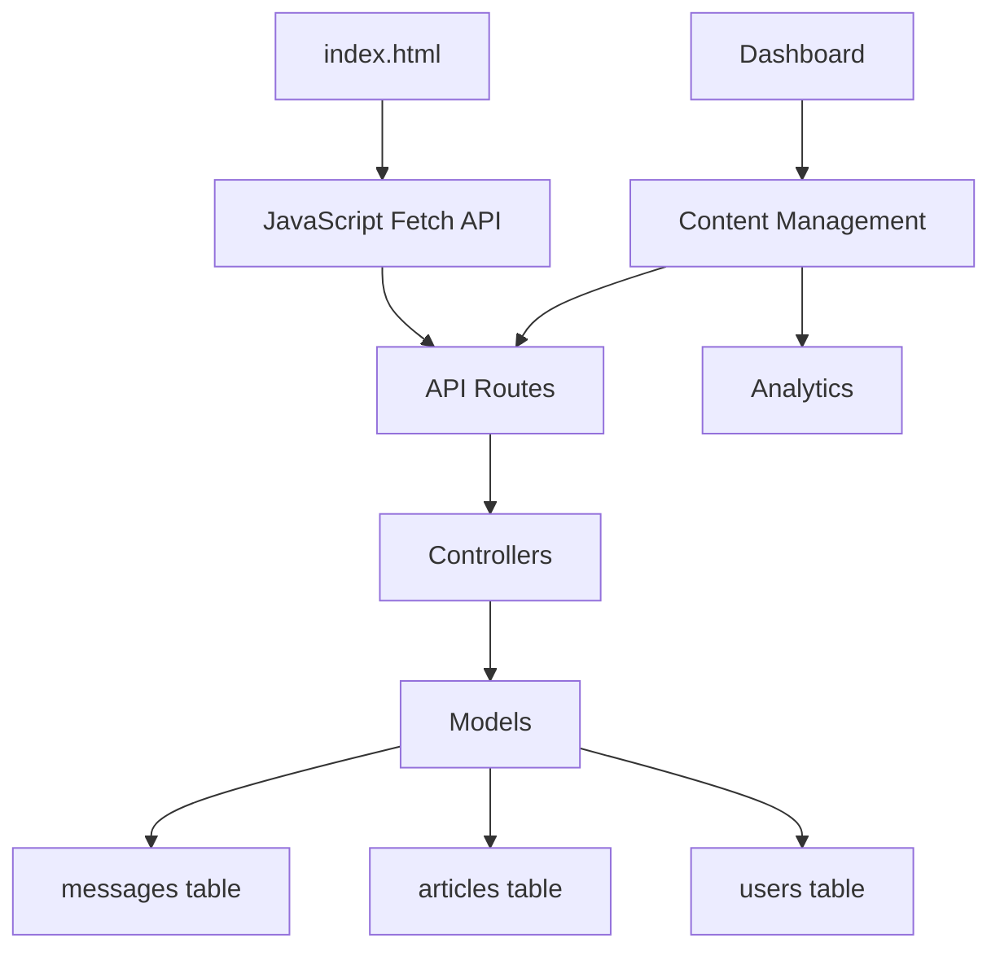
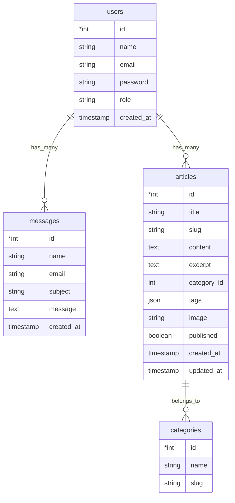

# Source of Truth Documentation

## Overview
This document serves as the authoritative source of truth for Nandang Duryat's portfolio website. It encompasses the current static implementation, planned dynamic features, architecture, and technical specifications. This ensures consistency across development, maintenance, and future enhancements.

## Current State
- **Type**: Static website (HTML/CSS/JS)
- **Purpose**: Personal portfolio showcasing 3D Artist & Developer skills
- **Technologies**:
  - Frontend: HTML5, CSS3, JavaScript (ES6+)
  - Libraries: Bootstrap 4.6, jQuery 3.6.0, WOW.js
  - Build: None (static files)
- **Hosting**: Local development, ready for static hosting (GitHub Pages, Netlify, etc.)
- **Version Control**: Git (initialized with main branch)

## Architecture Diagram



## File Structure
```
folioflix/
├── index.html                          # Main portfolio page
├── contact-form.php                    # Contact form handler (PHP mail)
├── fortpolio_nandur.json               # Data source (reference)
├── Architecture.md                     # Architecture documentation
├── .gitignore                          # Git ignore rules
├── .git/                               # Git repository
└── assets/
    ├── css/
    │   ├── style.css                   # Main stylesheet
    │   ├── mobile.css                  # Mobile responsive styles
    │   ├── animate.css                 # Animation library
    │   ├── super-classes.css           # Utility classes
    │   └── bootstarp/bootstrap.min.css # Bootstrap framework
    ├── js/
    │   ├── main.js                     # Custom JavaScript (separated)
    │   ├── custom-script.js            # Additional scripts
    │   ├── contact-form.js             # Form validation
    │   ├── bootstrap.min.js            # Bootstrap JS
    │   ├── jquery-3.6.0.min.js         # jQuery library
    │   ├── popper.min.js               # Popper.js
    │   └── wow.js                      # WOW animations
    └── image/
        ├── portfolio-model-img1.jfif   # Portfolio images
        ├── footer-logo.png             # Logo
        └── [other static images]
```

## Key Components

### 1. Hero Section
- **Element**: `<h1 id="dynamic-name" class="dynamic-name">`
- **Function**: Displays typing effect with name and role
- **JavaScript**: `typeWriter()` function in `main.js`
- **CSS**: `.dynamic-name` class for styling

### 2. Portfolio Section
- **Filter**: Buttons with `filterSelection()` function
- **Modals**: Bootstrap modals for project details
- **Images**: Static images with descriptive alt text

### 3. Contact Form
- **Handler**: `contact-form.php` (sends email)
- **Validation**: jQuery Validate plugin
- **Fields**: Name, Email, Subject, Message

### 4. Navigation
- **Type**: Single-page with smooth scrolling
- **Active States**: Managed by JavaScript event listeners

## Data Flow Diagram



## Planned Dynamic Architecture



## Database Schema (Planned)



## API Endpoints (Planned)

| Method | Endpoint | Description | Auth Required |
|--------|----------|-------------|---------------|
| GET | /api/messages | Fetch all messages | Yes |
| POST | /api/messages | Submit contact message | No |
| GET | /api/articles | Fetch published articles | No |
| POST | /api/articles | Create article | Yes |
| PUT | /api/articles/{id} | Update article | Yes |
| DELETE | /api/articles/{id} | Delete article | Yes |
| POST | /api/auth/login | Admin login | No |
| POST | /api/auth/logout | Admin logout | Yes |

## Security Considerations
- **Input Validation**: Sanitize all user inputs
- **CSRF Protection**: Implement tokens for forms
- **SQL Injection**: Use prepared statements
- **File Uploads**: Validate types, sizes, and store securely
- **Authentication**: JWT or session-based for admin
- **HTTPS**: Enforce SSL/TLS
- **Rate Limiting**: Prevent spam on contact forms

## Performance Benchmarks
- **Page Load Time**: < 3 seconds
- **First Contentful Paint**: < 1.5 seconds
- **Lighthouse Score**: > 90 (Performance, Accessibility, Best Practices, SEO)
- **Mobile Responsiveness**: 100% on all devices

## Testing Strategy
- **Unit Tests**: JavaScript functions, PHP classes
- **Integration Tests**: API endpoints, database operations
- **E2E Tests**: User workflows (Cypress or Selenium)
- **Manual Testing**: Cross-browser compatibility

## Deployment Checklist
- [ ] Environment variables configured
- [ ] Database migrated and seeded
- [ ] Static assets optimized
- [ ] HTTPS enabled
- [ ] SEO meta tags updated
- [ ] Analytics tracking added
- [ ] Backup strategy in place
- [ ] Monitoring tools set up

## Change Log
- **v1.0.0** (Current): Static portfolio with basic functionality
- **v2.0.0** (Planned): Dynamic backend with admin panel
- **v2.1.0** (Future): Blog system integration
- **v2.2.0** (Future): Advanced analytics and user engagement features

## Contact
For questions or contributions: founder@nandurstudio.com

This document is the single source of truth and should be updated with any architectural changes.