# SSH Port 22 ISP Blocking - Complete Explanation

## Problem Summary
Ketika mencoba SSH ke droplet pribadi (146.190.87.175:22), koneksi **timeout/ditolak**, padahal:
- Server running normal
- Firewall Ubuntu allow port 22
- SSH public key sudah di-authorize
- Ping ke IP bisa (ICMP works)

**Kesimpulan**: ISP memblock **port 22 TCP outbound** secara selektif.

---

## 1. Kenapa ISP Block Port 22?

### Background: Port 22 adalah SSH Standard
- **Port 22** = standard untuk SSH (Secure Shell)
- Digunakan untuk: remote server access, file transfer (SCP), git operations
- Juga sering digunakan untuk **brute-force attacks** dan **botnets**

### Alasan ISP Block Port 22


**Alasan ISP block:**
1. **Security**: Prevent botnets/worms yang spread via SSH
2. **Control**: Prevent users dari hosting illegal servers
3. **Policy**: ISP corporate policy untuk enterprise/residential networks
4. **Spam Prevention**: Block SSH digunakan untuk spam/abuse

### Evidence dari Troubleshooting Kami

```powershell
# Test port 22 TANPA VPN
Test-NetConnection -ComputerName 146.190.87.175 -Port 22
TcpTestSucceeded : False  ← ✗ ISP block

# Test port 443 TANPA VPN
Test-NetConnection -ComputerName 146.190.87.175 -Port 443
TcpTestSucceeded : False  ← ✗ Juga diblock (port 443 ada di-use Apache)

# Test PING (ICMP protocol) TANPA VPN
ping 146.190.87.175
Reply from 146.190.87.175: bytes=32 time=17ms  ← ✓ ICMP allowed
```

**Kesimpulan**: ISP block semua TCP port outbound ke external servers, EXCEPT HTTP(80) dan HTTPS(443).

---

## 2. Kenapa Perlu Ubah ke Port 443?

### Strategi: "Hide SSH dalam HTTPS"

```mermaid
sequenceDiagram
    participant Client as Your PC
    participant ISP as ISP Firewall
    participant Server as SSH Server

    rect rgb(200, 220, 255)
    Note over Client,Server: Without VPN - Port 22 Blocked
    Client->>ISP: TCP SYN → Port 22
    ISP-->>Client: ✗ Connection Refused (Blocked)
    end

    rect rgb(220, 255, 200)
    Note over Client,Server: With SSH on Port 443
    Client->>ISP: TCP SYN → Port 443
    ISP-->>Client: ✓ Connection Allowed (HTTPS)
    Client->>Server: SSH Protocol
    Server-->>Client: SSH Response
    end
```



**Problem**: Port 443 sudah occupied oleh Apache HTTPS di droplet.

---

## 3. Kenapa VPN (Cloudflare WARP) Works?

### Cara VPN Bypass Port Blocking

**Tanpa VPN:**

```mermaid
graph TD
    A1["🖥️ Your Computer<br/>192.168.1.7"]
    B1["🔒 ISP Firewall"]
    C1["📡 SSH Droplet<br/>146.190.87.175:22"]
    
    A1 -->|TCP Port 22<br/>❌ BLOCKED| B1
    B1 -->|Connection Refused| C1
    
    style A1 fill:#e8f4f8,color:#000
    style B1 fill:#ffd4e5,color:#000
    style C1 fill:#f5e6e8,color:#000
```


**Dengan VPN (Cloudflare WARP):**

```mermaid
graph TD
    A2["🖥️ Your Computer<br/>192.168.1.7"]
    
    subgraph VPN["🔐 Cloudflare WARP Tunnel<br/>(Encrypted TLS)"]
        direction TB
        W["Tunnel 172.16.0.2<br/>HTTPS Port 443"]
        SSH["SSH Request<br/>(Hidden inside)"]
        W --> SSH
    end
    
    B2["🔒 ISP Firewall"]
    C2["📡 SSH Droplet<br/>146.190.87.175:22"]
    
    A2 -->|HTTPS 443<br/>✅ ALLOWED| VPN
    VPN -->|Only sees HTTPS<br/>from Cloudflare IP| B2
    B2 -->|SSH from trusted<br/>Cloudflare network| C2
    C2 -->|✅ Connection Accepted| B2
    
    style A2 fill:#e8f4f8,color:#000
    style W fill:#c9e4ff,color:#000
    style SSH fill:#b0d4ff,color:#000
    style B2 fill:#d4f1d4,color:#000
    style C2 fill:#e8f5e9,color:#000
    style VPN fill:#e3f2fd,color:#000,stroke:#2196F3,stroke-width:3px
```


### Technical Details

**Apa itu Cloudflare WARP?**
- **VPN service** dari Cloudflare (gratis)
- Route semua traffic melalui **Cloudflare network** yang private
- ISP hanya lihat traffic ke Cloudflare servers (port HTTPS 443)
- ISP TIDAK bisa lihat SSH traffic (encrypted + tunneled)

**Flow:**

```mermaid
sequenceDiagram
    participant You as Your PC
    participant WARP as Cloudflare WARP
    participant ISP as ISP Network
    participant Droplet as SSH Droplet

    You->>WARP: 1. Start VPN Connection
    WARP->>WARP: 2. Create encrypted TLS tunnel
    WARP->>ISP: 3. Establish HTTPS (port 443)
    ISP-->>WARP: ✓ Allowed (normal HTTPS)
    
    Note over You,WARP: All traffic now tunneled
    
    You->>WARP: 4. Send SSH request
    WARP->>WARP: 5. Encrypt inside tunnel
    WARP->>Droplet: 6. SSH from Cloudflare IP
    Droplet-->>WARP: 7. SSH Response
    WARP-->>You: 8. SSH Response (decrypted)
```



### Bukti dari Kami

```powershell
# Test SEBELUM VPN
Test-NetConnection -ComputerName 146.190.87.175 -Port 22
InterfaceAlias : Wi-Fi
SourceAddress  : 192.168.1.7
TcpTestSucceeded : False  ← ✗ Blocked

# Test SESUDAH VPN
Test-NetConnection -ComputerName 146.190.87.175 -Port 22
InterfaceAlias : CloudflareWARP  ← ← ← Changed!
SourceAddress  : 172.16.0.2       ← ← ← Different IP (from WARP)
TcpTestSucceeded : True   ← ✓ SUCCESS!
```

**Key point**: ISP sees source IP berubah dari `192.168.1.7` (your real IP) ke `172.16.0.2` (Cloudflare tunnel IP). Port 22 dari Cloudflare network allowed!

---

## 4. Kenapa IP Server Tetap Bisa Diakses Tanpa VPN?

### ICMP vs TCP - Different Protocols

```mermaid
graph TD
    A["Internet Protocols<br/>OSI Model"]
    A --> B["📱 Layer 7: Application<br/>HTTP, HTTPS, SSH"]
    B --> C["🔀 Layer 4: Transport<br/>TCP Ports<br/>🚫 ISP blocks specific ports"]
    C --> D["📍 Layer 3: Network<br/>IP, ICMP Ping<br/>✅ Usually allowed"]
    
    style B fill:#e3f2fd,color:#000
    style C fill:#ffccbc,color:#000
    style D fill:#c8e6c9,color:#000
```



### ICMP (Ping) vs TCP (SSH)

```mermaid
graph TB
    subgraph PING["✅ PING - ICMP Protocol"]
        direction TB
        P1["ICMP Echo Request<br/>\"Are you alive?\""]
        P2["✅ No port number involved"]
        P3["✅ ISP allow for network admin"]
        P4["✅ Usually NOT blocked"]
        
        P1 --> P2 --> P3 --> P4
    end
    
    subgraph SSH["❌ SSH - TCP Protocol"]
        direction TB
        S1["TCP SYN → Port 22<br/>\"Connect to port 22\""]
        S2["⚠️ Port-specific firewall rule"]
        S3["⚠️ ISP CAN block specific ports"]
        S4["❌ Port 22 OFTEN blocked"]
        
        S1 --> S2 --> S3 --> S4
    end
    
    style PING fill:#e8f5e9,color:#000
    style SSH fill:#fff3e0,color:#000
    style P4 fill:#b5e7a0,color:#000
    style S4 fill:#ffccbc,color:#000
```



### ISP Firewall Rules (Common)

```mermaid
graph TD
    A["🔒 ISP Firewall Rules"]
    
    A --> B1["Port 22 SSH<br/>❌ BLOCKED"]
    A --> B2["Port 25 SMTP<br/>❌ BLOCKED"]
    A --> G1["Port 80 HTTP<br/>✅ ALLOWED"]
    A --> G2["Port 443 HTTPS<br/>✅ ALLOWED"]
    A --> G3["ICMP Ping<br/>✅ ALLOWED"]
    
    style A fill:#f3e5f5,color:#000
    style B1 fill:#ffccbc,color:#000
    style B2 fill:#ffccbc,color:#000
    style G1 fill:#c8e6c9,color:#000
    style G2 fill:#c8e6c9,color:#000
    style G3 fill:#b5e7a0,color:#000
```



### Hasil Troubleshooting Kami

```powershell
# Test 1: ICMP Ping
ping 146.190.87.175
Reply from 146.190.87.175: bytes=32 time=17ms TTL=51
Packets: Sent = 4, Received = 4, Lost = 0%  ← ✓ 100% success

# Test 2: TCP Port 22
Test-NetConnection -ComputerName 146.190.87.175 -Port 22
PingSucceeded : True        ← ✓ Ping works
TcpTestSucceeded : False    ← ✗ TCP port 22 blocked

# Test 3: TCP Port 443
Test-NetConnection -ComputerName 146.190.87.175 -Port 443
PingSucceeded : True        ← ✓ Ping works
TcpTestSucceeded : False    ← ✗ TCP port 443 juga blocked (Apache listening)

# Test 4: Port 22 dengan VPN
# (Setelah connect Cloudflare WARP)
Test-NetConnection -ComputerName 146.190.87.175 -Port 22
InterfaceAlias : CloudflareWARP
TcpTestSucceeded : True  ← ✓ Works via VPN!
```

---

## 5. Visualisasi Lengkap

### Scenario 1: Direct Connection (ISP blocks port 22)

```mermaid
graph LR
    subgraph Client["Your PC"]
        A1["ICMP Ping"]
        A2["TCP SSH:22"]
        A3["TCP HTTPS:443"]
    end
    
    subgraph ISP["ISP Firewall"]
        B1["Layer 3: ICMP allowed"]
        B2["Layer 4: Port 22 blocked"]
        B3["Port 443 status"]
    end
    
    subgraph Server["Droplet"]
        C1["Responds to ping"]
        C2["SSH not reached"]
        C3["HTTP conflict"]
    end
    
    A1 -->|✅| B1 -->|✅| C1
    A2 -->|❌| B2 -->|❌| C2
    A3 -->|❌| B3 -->|❌| C3
    
    style B1 fill:#90EE90
    style B2 fill:#FFB6C6
    style B3 fill:#FFB6C6
```



**Result**: Can ping, cannot SSH

### Scenario 2: Via VPN (WARP tunnels SSH inside HTTPS)


**Result**: SSH works because it's inside VPN tunnel!

---

## 6. Solusi Summary

| Method | Port | Works? | Kelebihan | Kekurangan |
|--------|------|--------|-----------|------------|
| **Direct SSH** | 22 | ❌ | Cepat, simple | ISP block |
| **SSH via 443** | 443 | ❌ | Port allowed ISP | Conflict dengan Apache |
| **VPN (WARP)** | Tunnel HTTPS | ✅ | Works, free, gratis | Extra latency |
| **DigitalOcean Console** | Web | ✅ | No SSH, web based | Slower, minimal |

---

## 7. Technical Takeaways

### Port-based Blocking
```
ISP blocking adalah LAYER 4 (Transport) blocking
- ISP firewall inspect TCP port number
- Jika port di-block list, koneksi ditolak
- ICMP (Layer 3) tidak punya port number
- Jadi ICMP ping tetap works
```

### VPN Tunneling
```
VPN encrypt semua traffic dalam HTTPS tunnel
- ISP lihat: "TLS traffic to Cloudflare" ✓
- ISP TIDAK lihat: "SSH inside tunnel" ✗
- Droplet terima: "SSH from Cloudflare IP" ✓
- Authentication: Certificate + encryption
```

### Network Layers (OSI Model)

```mermaid
graph TD
    L7["Layer 7: Application<br/>(SSH, HTTP, HTTPS, DNS)"]
    L6["Layer 6: Presentation<br/>(Encryption, Compression)"]
    L5["Layer 5: Session<br/>(Connection Management)"]
    L4["Layer 4: Transport<br/>TCP/UDP - PORT NUMBERS<br/>← ← ← Port 22 blocking here"]
    L3["Layer 3: Network<br/>IP Addresses - ICMP<br/>← ← ← Ping works here"]
    L2["Layer 2: Data Link<br/>(MAC Addresses)"]
    L1["Layer 1: Physical<br/>(Cables, WiFi)"]
    
    L7 --> L6 --> L5 --> L4 --> L3 --> L2 --> L1
    
    style L4 fill:#FFB6C6
    style L3 fill:#90EE90
    
    L4_Note["🚫 ISP blocks specific TCP ports"]
    L3_Note["✅ ICMP protocol allowed"]
    
    L4 -.-> L4_Note
    L3 -.-> L3_Note
```



**ISP blocking port 22 = Layer 4 blocking**
**Ping works = Layer 3 still functional**
**VPN bypass = Move SSH into Layer 6-7 (inside encrypted tunnel)**

---

## Conclusion

```
ISP port 22 blocking adalah praktik umum untuk:
✓ Keamanan (prevent botnets/brute-force)
✓ Control (prevent hosting)
✓ Policy (corporate networks)

Solusi:
1. VPN (Cloudflare WARP) - Recommended ✅
   - Free
   - Works instantly
   - Transparent untuk user

2. DigitalOcean Console - Fallback ✅
   - Web-based
   - Always works
   - No SSH needed

3. Change port (443) - Not viable di case ini ❌
   - Apache already using 443
   - Would need certificate management
   - Still requires port forwarding

4. Request ISP unblock - Long-term ⚠️
   - Most ISP won't unblock
   - Takes time
   - May require business plan
```

---

## References

- [ISP Blocking Best Practices](https://www.linode.com/docs/networking/ssh-port-blocking/)
- [Cloudflare WARP Documentation](https://developers.cloudflare.com/warp-client/)
- [TCP/IP Port Blocking](https://en.wikipedia.org/wiki/Port_forwarding)
- [ICMP vs TCP](https://www.cisco.com/c/en/us/support/docs/ip/ip-addressing-services/13020-104.html)
