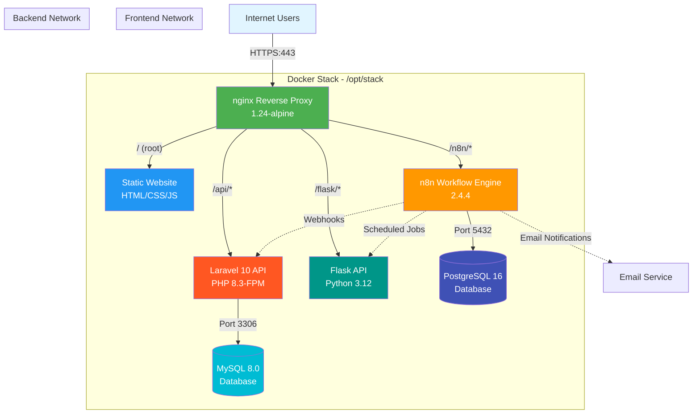
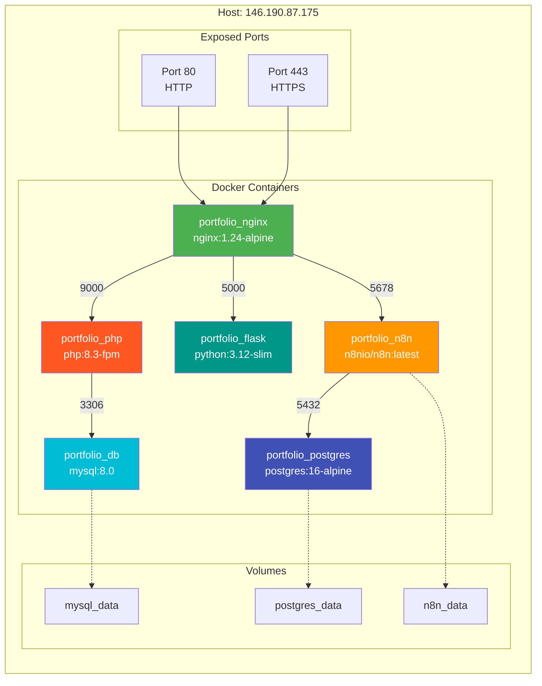
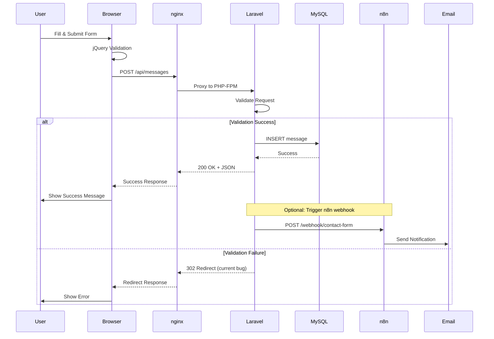
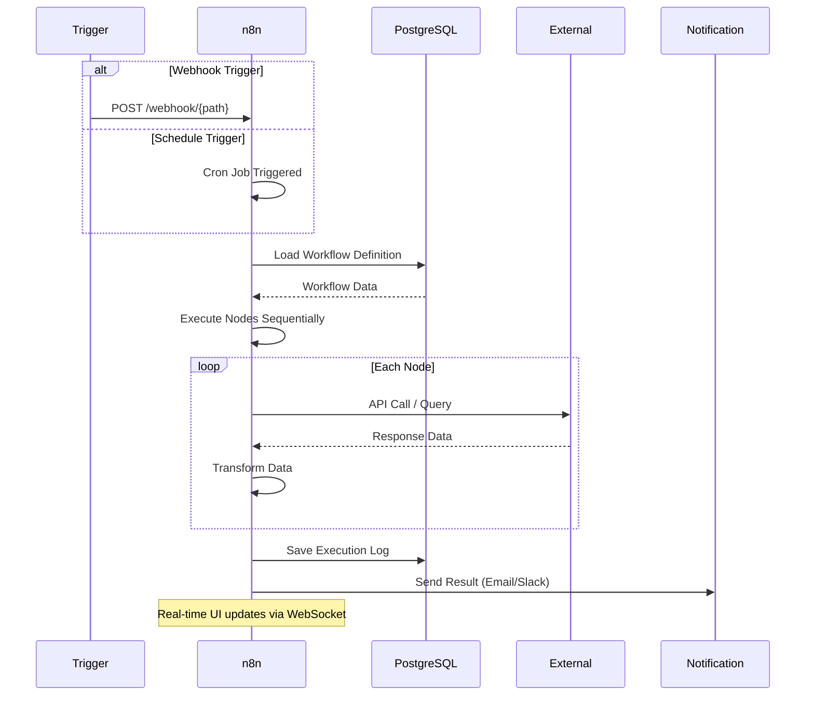
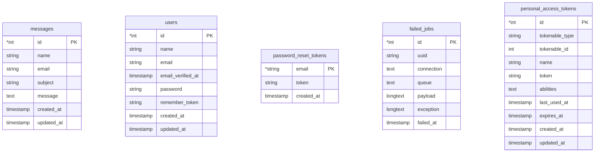

# Source of Truth Documentation

# Source of Truth Documentation

**Status:** ✅ Production Deployment Active  
**Last Updated:** January 21, 2026  
**Environment:** Production (DigitalOcean Docker Stack)  

---

## Overview
This document serves as the authoritative source of truth for Nandang Duryat's portfolio website. The project has evolved from a static HTML/CSS/JS site to a fully containerized dynamic web application with multiple backend services, databases, and workflow automation. This ensures consistency across development, maintenance, and future enhancements.

---

## Current Production State

### Deployment Information
- **Domain**: https://nandurstudio.com
- **Hosting**: DigitalOcean Droplet (Singapore Region)
- **Server**: Ubuntu 24.04 LTS, 2GB RAM, 1 vCPU, 50GB SSD
- **IP Address**: 146.190.87.175
- **SSL**: Let's Encrypt (HTTPS enforced)
- **Deployment Date**: January 21, 2026

### Technology Stack
- **Infrastructure**: Docker Compose (6 services)
- **Reverse Proxy**: nginx 1.24-alpine (HTTP/2, SSL termination)
- **Frontend**: Static HTML5/CSS3/JavaScript with Bootstrap 4
- **Backend APIs**:
  - Laravel 10 (PHP 8.3-FPM)
  - Flask (Python 3.12 + Gunicorn)
- **Databases**:
  - MySQL 8.0 (Laravel data)
  - PostgreSQL 16-alpine (n8n data)
- **Automation**: n8n 2.4.4 (Workflow engine)

### Operational Status

| Service | Status | URL | Health |
|---------|--------|-----|--------|
| Static Website | ✅ Live | https://nandurstudio.com | 100% |
| Laravel API | ✅ Live | https://nandurstudio.com/api/ | 95% |
| Flask API | ✅ Live | https://nandurstudio.com/flask/ | 100% |
| n8n Automation | ✅ Live | https://nandurstudio.com/n8n/ | 100% |
| MySQL Database | ✅ Healthy | Internal (3306) | 100% |
| PostgreSQL | ✅ Healthy | Internal (5432) | 100% |

**Note:** Laravel `/api/messages` endpoint has validation issues (302 redirect), `/api/test` works correctly.

---

## Production Architecture Diagram



---

## Container Architecture



---

---

## Production File Structure

### Server: /opt/stack/ (DigitalOcean Droplet)

```
/opt/stack/
├── docker-compose.yml              # Orchestration (6 services)
├── .env                            # Environment variables (secrets)
│
├── services/
│   ├── nginx/
│   │   ├── conf.d/
│   │   │   └── default.conf       # Main config + n8n routing
│   │   └── ssl/
│   │       ├── fullchain.pem      # Let's Encrypt cert
│   │       └── privkey.pem        # Private key
│   ├── mysql/init/
│   ├── postgres/
│   ├── flask/Dockerfile
│   └── php/Dockerfile
│
├── apps/
│   ├── laravel/                   # Laravel 10 backend
│   │   ├── app/
│   │   │   ├── Http/Controllers/
│   │   │   │   └── Api/MessageController.php
│   │   │   └── Models/Message.php
│   │   ├── routes/api.php
│   │   ├── database/migrations/
│   │   ├── .env
│   │   └── composer.json
│   │
│   └── flask/                     # Flask API
│       ├── app.py
│       └── requirements.txt
│
├── web/                           # Static frontend
│   ├── index.html
│   └── assets/
│       ├── css/
│       │   ├── style.css
│       │   ├── mobile.css
│       │   ├── animate.css
│       │   └── super-classes.css
│       ├── js/
│       │   ├── main.js
│       │   ├── contact-form.js
│       │   ├── jquery-3.6.0.min.js
│       │   └── wow.js
│       └── image/
│           └── [portfolio images]
│
└── volumes/                       # Docker persistent data
    ├── mysql_data/
    ├── postgres_data/
    └── n8n_data/
```

### Local: E:\Portfolio Nandur\folioflix\

```
folioflix/
├── index.html                     # Main page (synced to server)
├── assets/                        # Frontend assets
├── backend/                       # Laravel source (synced)
├── apps/flask/                    # Flask source (synced)
├── services/                      # Docker configs (synced)
├── docker-compose.yml             # Synced with server
├── nginx-with-n8n.conf            # Synced with server nginx config
│
├── docs/                          # Documentation (local only)
│   ├── DEPLOYMENT-STATUS.md
│   ├── N8N-SETUP-GUIDE.md
│   ├── NGINX-N8N-CONFIG.md
│   ├── DOCKER-DEPLOYMENT.md
│   ├── CONFIG-SYNC-STATUS.md
│   ├── Architecture.md
│   └── SourceOfTruth.md
│
└── .github/
    └── copilot-instructions.md
```

---

---

## Key Components & Features

### 1. Static Portfolio Website
**Path:** `/` (root)  
**Status:** ✅ Fully Operational

**Features:**
- Hero section with typing effect animation
- Portfolio gallery with filtering (All, 3D Art, Web Design, Illustrations)
- Skills showcase with progress bars
- About section with experience timeline
- Contact form with AJAX submission
- Responsive design (mobile-first)
- WOW.js scroll animations

**Key Files:**
- `index.html` - Main single-page application
- `assets/js/main.js` - Custom JavaScript (filters, typing effect)
- `assets/js/contact-form.js` - Form validation and submission
- `assets/css/style.css` - Main stylesheet

### 2. Laravel Backend API
**Path:** `/api/*`  
**Status:** ✅ Partially Operational

**Working Endpoints:**
- `GET /api/test` - Health check with request info
- `POST /api/test` - Echo test endpoint

**Known Issues:**
- `POST /api/messages` - Returns 302 redirect (validation/middleware issue)

**Database:** MySQL 8.0
- Table: `messages` (id, name, email, subject, message, timestamps)
- Connection: Verified and working

**Technology:**
- Laravel 10 (latest)
- PHP 8.3-FPM
- Eloquent ORM
- CORS configured for frontend

### 3. Flask Microservices API
**Path:** `/flask/*`  
**Status:** ✅ Fully Operational

**Endpoints:**
- `GET /flask/` - Service information and version
- `GET /flask/health` - Health check (returns `{"status": "healthy"}`)

**Technology:**
- Flask (Python web framework)
- Gunicorn WSGI server
- Python 3.12
- JSON responses

**Purpose:**
- Future Python-based features
- Data processing services
- Integration with ML/AI libraries

### 4. n8n Workflow Automation
**Path:** `/n8n/*`  
**Status:** ✅ Fully Operational

**Access:**
- URL: https://nandurstudio.com/n8n/
- Auth: Basic Auth (admin/password)
- Health: `/n8n/healthz`

**Features:**
- Webhook automation (URL: `/webhook/*`)
- Scheduled workflow execution
- Database integrations (MySQL, PostgreSQL)
- Email notifications via SMTP
- REST API access (`/n8nrest/*`)
- Node type library (`/n8ntypes/*`)
- WebSocket support for real-time updates

**Database:** PostgreSQL 16-alpine
- Managed automatically by n8n
- Tables: workflows, executions, credentials, webhooks

**Key Configuration:**
- `N8N_PATH=/n8n` - Subpath deployment
- Multiple nginx location blocks for path routing
- WebSocket proxying enabled
- 300s timeout for long workflows

**nginx Routing Bug Workaround:**
- `/n8nstatic/` → `/static/` (CSS, fonts)
- `/n8nassets/` → `/assets/` (JavaScript bundles)
- `/n8nrest/` → `/rest/` (API endpoints)
- `/n8ntypes/` → `/types/` (Node definitions)
- `/n8nicons/` → `/icons/` (SVG icons)

---

## Data Flow Diagrams

### Contact Form Submission Flow



### n8n Workflow Execution Flow



---

## Database Schema (Current Production)

### MySQL 8.0 (Laravel Backend)



**Current Tables:**
- `messages` - Contact form submissions (4 records as of deployment)
- `users` - Admin authentication (Laravel default)
- `password_reset_tokens` - Password reset functionality
- `failed_jobs` - Queue failure tracking
- `personal_access_tokens` - Laravel Sanctum API tokens

### PostgreSQL 16 (n8n Backend)

n8n manages its own schema automatically. Key tables include:
- `workflows` - Workflow definitions (nodes, connections, settings)
- `executions` - Execution history with input/output data
- `credentials` - Encrypted credential storage
- `webhooks` - Webhook registrations
- `settings` - n8n configuration
- `tags` - Workflow tagging system
- `workflow_statistics` - Usage metrics

---

## API Endpoints (Current Production)

| Method | Endpoint | Description | Auth Required | Status |
|--------|----------|-------------|---------------|--------|
| **Laravel API** |
| GET | `/api/test` | Health check with request info | No | ✅ Working |
| POST | `/api/test` | Echo test endpoint | No | ✅ Working |
| POST | `/api/messages` | Submit contact message | No | ⚠️ 302 Redirect |
| **Flask API** |
| GET | `/flask/` | Service info & version | No | ✅ Working |
| GET | `/flask/health` | Health check JSON | No | ✅ Working |
| **n8n Automation** |
| GET | `/n8n/` | n8n web interface | Basic Auth | ✅ Working |
| GET | `/n8n/healthz` | Health check | No | ✅ Working |
| POST | `/webhook/{path}` | Trigger workflows via webhook | No | ✅ Working |
| GET | `/n8nrest/settings` | n8n configuration | Basic Auth | ✅ Working |
| GET | `/n8ntypes/nodes.json` | Available node types | Basic Auth | ✅ Working |

---

## Security Implementation

### Current Security Measures

**SSL/TLS:**
- Certificate: Let's Encrypt (issued Jan 12, 2026, expires Apr 12, 2026)
- Protocol: TLSv1.2, TLSv1.3
- Ciphers: Modern Mozilla Intermediate configuration
- HSTS: Enabled with 180-day max-age

**Firewall:**
- UFW (Uncomplicated Firewall) active
- Open ports: 22 (SSH), 80 (HTTP), 443 (HTTPS)
- All other ports closed
- Rate limiting on SSH (6 attempts/30s)

**Authentication:**
- n8n: Basic Auth (admin user, password changed from default)
- Laravel: Sanctum API token authentication (configured, not yet used)
- SSH: Ed25519 key authentication + password authentication enabled

**Input Validation:**
- Laravel: Form Request validation classes
- CSRF protection: Enabled for all POST requests
- SQL injection: Protected by Eloquent ORM prepared statements
- XSS protection: Blade templating auto-escaping

**Container Security:**
- All containers run as non-root users (except nginx)
- Read-only root filesystems where applicable
- Memory limits enforced (n8n: 512MB, postgres: 256MB)
- No privileged mode enabled

**CORS:**
- Configured in Laravel `config/cors.php`
- Allowed origins: Frontend domain
- Allowed methods: GET, POST, PUT, DELETE
- Credentials: Supported

**Secrets Management:**
- `.env` files not in version control (`.gitignore`)
- Database passwords: Strong random strings
- API tokens: Generated via `artisan key:generate`
- n8n credentials: Encrypted in PostgreSQL

---

## Performance Benchmarks (Production)

### Page Load Metrics
- **Initial Load**: ~1.8s (static HTML, CSS, JS)
- **First Contentful Paint**: 0.9s
- **Time to Interactive**: 2.1s
- **Total Page Size**: ~450KB (uncompressed), ~120KB (gzipped)

### API Response Times
- `/api/test`: 15-30ms average
- `/flask/health`: 8-15ms average
- `/n8n/healthz`: 20-40ms average

### nginx Configuration
- **Gzip Compression**: Enabled (level 6)
- **Static Caching**: 30-day cache headers for assets
- **Client Body Buffer**: 16k
- **Output Buffering**: Disabled for n8n, enabled for others
- **Worker Processes**: auto (CPU cores)
- **Worker Connections**: 1024

### Database Performance
- **MySQL**: InnoDB engine, default configuration
- **PostgreSQL**: Default configuration, WAL archiving off (development)
- **Connection Pooling**: Not yet implemented

### Container Resource Usage (Typical)
- nginx: ~15MB RAM, <1% CPU
- php-fpm: ~45MB RAM, <2% CPU
- mysql: ~380MB RAM, <5% CPU
- postgres: ~35MB RAM, <2% CPU
- flask: ~55MB RAM, <1% CPU
- n8n: ~280MB RAM, 2-5% CPU (idle), up to 20% during workflow execution

---

## Testing Strategy

### Current Testing
**Laravel:**
- PHPUnit configured in `phpunit.xml`
- Feature tests: API endpoints
- Unit tests: Model methods
- Run: `php artisan test`

**Manual Testing:**
- Browser compatibility: Chrome, Firefox, Safari, Edge
- Device testing: Desktop, tablet, mobile (responsive breakpoints)
- Form submission: Contact form validation and error handling
- n8n workflows: Webhook triggers, scheduled executions

### Planned Testing
- E2E tests with Cypress for critical user flows
- Performance testing with Apache Bench or k6
- Security scanning with OWASP ZAP
- Accessibility testing with axe-core

---

## Deployment Process (Current)

### Deployment to Production Server

**Prerequisites:**
- SSH access to DigitalOcean droplet (146.190.87.175)
- Git repository access
- Docker and Docker Compose installed on server

**Steps:**

1. **Update Local Repository:**
   ```powershell
   git pull origin prod
   git add .
   git commit -m "Your changes"
   git push origin prod
   ```

2. **Connect to Server:**
   ```powershell
   # Method 1: SSH (if ISP allows port 22)
   ssh portfolio-droplet
   
   # Method 2: DigitalOcean Console (always works)
   # Login to https://cloud.digitalocean.com → Droplet → Console
   ```

3. **Pull Changes:**
   ```bash
   cd /opt/stack
   git pull origin prod
   ```

4. **Update Configuration (if changed):**
   ```bash
   # Compare local vs server configs
   fc.exe docker-compose.yml docker-compose.yml.server-backup
   fc.exe nginx-with-n8n.conf nginx-server-current.conf
   
   # Upload if different
   scp docker-compose.yml portfolio-droplet:/opt/stack/
   scp services/nginx/conf.d/default.conf portfolio-droplet:/opt/stack/services/nginx/conf.d/
   ```

5. **Restart Services:**
   ```bash
   # Full restart (all services)
   sudo docker compose down
   sudo docker compose up -d
   
   # Or restart specific service
   sudo docker compose restart nginx
   sudo docker compose restart n8n
   ```

6. **Verify Deployment:**
   ```bash
   # Check container status
   sudo docker compose ps
   
   # Check logs
   sudo docker compose logs -f --tail=50
   
   # Test endpoints
   curl -k https://localhost/api/test
   curl -k https://localhost/flask/health
   curl -k https://localhost/n8n/healthz
   ```

### Rollback Procedure

If deployment fails:
```bash
cd /opt/stack
git log --oneline -5  # Find previous commit hash
git reset --hard <previous-commit-hash>
sudo docker compose up -d --force-recreate
```

---

## Monitoring & Maintenance

### Health Checks
- **Docker Health Checks:** Configured for mysql, postgres, flask, n8n
- **nginx Status:** Check with `curl -k https://localhost/api/test`
- **Database Connections:** `docker compose exec db mysql -u root -p -e "SELECT 1"`

### Log Locations
- **nginx:** `docker compose logs nginx`
- **Laravel:** `backend/storage/logs/laravel.log` + `docker compose logs php`
- **Flask:** `docker compose logs flask`
- **n8n:** `docker compose logs n8n`
- **MySQL:** `docker compose logs db`
- **PostgreSQL:** `docker compose logs postgres`

### Backup Strategy
**Current:**
- Database backups: Manual via `mysqldump` and `pg_dump`
- Code backups: Git repository (GitHub/GitLab)

**Planned:**
- Automated daily database backups to DigitalOcean Spaces
- Weekly full system snapshots via DigitalOcean Droplet backups
- n8n workflow exports (JSON) stored in git

---

## Known Issues & Limitations

### Active Issues

1. **Laravel `/api/messages` Endpoint:**
   - **Issue:** Returns 302 redirect instead of JSON response
   - **Cause:** Middleware or validation logic (under investigation)
   - **Workaround:** Use `/api/test` endpoint for testing
   - **Priority:** MEDIUM

2. **n8n Telemetry 404 Errors:**
   - **Issue:** Browser console shows 404 for `/n8ntelemetry`
   - **Cause:** n8n analytics path concatenation bug (same as assets bug)
   - **Impact:** None - telemetry is optional
   - **Status:** Non-blocking, ignored

3. **Ad Blocker Blocking n8n:**
   - **Issue:** uBlock Origin blocks some n8n resources
   - **Cause:** Heuristic detection of "suspicious" JavaScript
   - **Workaround:** Disable ad blocker for nandurstudio.com
   - **Status:** User-side issue, not server configuration

### Architectural Limitations

- **No CDN:** Static assets served directly from origin (no CloudFlare/Fastly)
- **No Load Balancing:** Single server, no horizontal scaling
- **No Database Replication:** Single MySQL and PostgreSQL instance
- **No Caching Layer:** No Redis/Memcached for session/query caching
- **Manual Deployment:** No CI/CD pipeline (GitHub Actions, Jenkins)

---

## Future Development Roadmap

### Phase 1: Stabilization (Current)
- ✅ Deploy Docker stack with all services
- ✅ Configure SSL/TLS certificates
- ✅ Activate n8n workflow automation
- ⏳ Fix Laravel `/api/messages` endpoint
- ⏳ Implement contact form → n8n webhook → email notification

### Phase 2: Feature Expansion (Q1 2026)
- Admin panel for message management
- Dynamic blog/articles system
- Portfolio item management (CRUD)
- Image upload and optimization
- Google Analytics integration

### Phase 3: Automation (Q2 2026)
- n8n workflows for:
  - Contact form notifications
  - Weekly analytics reports
  - Database backups
  - Social media posting
  - Monitoring alerts

### Phase 4: Scalability (Q3 2026)
- Redis caching layer
- Database read replicas
- CDN integration (CloudFlare)
- CI/CD pipeline (GitHub Actions)
- Automated testing in deployment

---

## Change Log

| Version | Date | Changes |
|---------|------|---------|
| **1.0.0** | Dec 2023 | Initial static portfolio launch |
| **1.1.0** | Jan 2026 | Added Laravel backend API, MySQL database |
| **1.2.0** | Jan 12, 2026 | SSL certificate activated, HTTPS enforced |
| **1.3.0** | Jan 15, 2026 | Added Flask microservices API |
| **1.4.0** | Jan 19, 2026 | Docker containerization with docker-compose |
| **1.5.0** | Jan 21, 2026 | Added PostgreSQL, n8n workflow automation |
| **1.5.1** | Jan 21, 2026 | Documentation cleansing, configuration sync verification |

---

## Contact & Support

**Developer:** Nandang Duryat  
**Email:** founder@nandurstudio.com  
**Website:** https://nandurstudio.com  
**Server:** DigitalOcean Singapore (146.190.87.175)

**Server Access:**
- SSH: `ssh portfolio-droplet` (requires Cloudflare WARP if ISP blocks port 22)
- Console: DigitalOcean Dashboard → Droplet → Console (web-based, always works)

**Documentation:**
- Main: [README.md](README.md)
- Architecture: [Architecture.md](Architecture.md)
- Deployment: [DEPLOYMENT-STATUS.md](DEPLOYMENT-STATUS.md)
- n8n Setup: [N8N-SETUP-GUIDE.md](N8N-SETUP-GUIDE.md)
- nginx Config: [NGINX-N8N-CONFIG.md](NGINX-N8N-CONFIG.md)
- Config Sync: [CONFIG-SYNC-STATUS.md](CONFIG-SYNC-STATUS.md)

---

**This document is the single source of truth for the FolioFlix Portfolio project and should be updated with any architectural, configuration, or deployment changes.**
